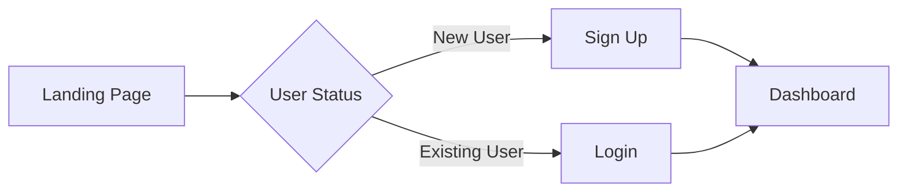
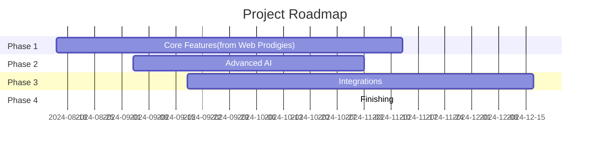
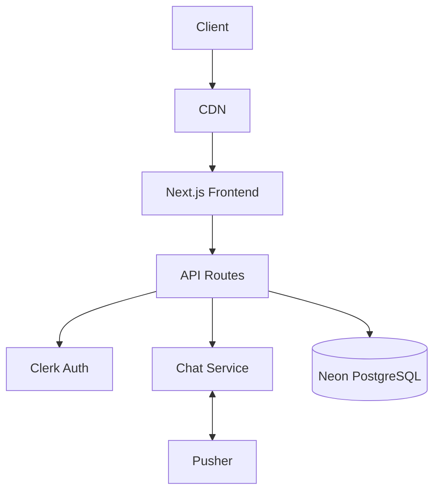

# AI Chatbot Platform - Project Documentation 🤖

## Table of Contents

- [Overview](#overview)
- [Key Features](#key-features)
- [Technical Architecture](#technical-architecture)
- [User Journey](#user-journey)
- [Implementation Details](#implementation-details)
- [Security & Performance](#security--performance)
- [Future Enhancements](#future-enhancements)

## Overview 🌟

A modern AI chatbot platform designed specifically for sales and customer engagement. The platform combines sales-trained AI models with customizable chatbots that businesses can easily embed into their websites.

### Key Highlights
- Sales-optimized AI responses
- Real-time customer engagement
- Easy website integration
- Customizable chat interface
- Analytics and performance tracking

### Mission Statement
To empower businesses with AI-driven sales automation that converts visitors into customers while providing 24/7 intelligent customer support.

### Core Benefits
- **Sales Optimization**: Pre-trained on sales conversations and techniques
- **Cost Reduction**: Automated customer engagement and lead qualification
- **24/7 Availability**: Continuous customer support and lead capture
- **Easy Integration**: Simple embed code for any website
- **Data Insights**: Detailed analytics on customer interactions and conversions

## Key Features 🎯

### 1. Chatbot Creation & Management

- **AI Chat Configuration**
  - Custom domain integration
  - Chat window customization
  - Brand theme personalization
  - Multiple bot deployment
  - Real-time chat preview

- **Conversation Management**
  - Sales-focused responses
  - Context-aware interactions
  - Automated lead qualification
  - Smart response handling
  - Chat history tracking

### 2. AI Integration

- **Natural Language Processing**
  - Context-aware responses
  - Sentiment analysis
  - Multi-language support
  - Learning from conversations

### 3. Customization Options

- **Appearance**

  - Theme customization
  - Brand color integration
  - Custom icons and avatars
  - Responsive design for all devices

- **Behavior**
  - Working hours configuration
  - Fallback responses
  - Auto-response timing
  - Personalized greetings

### 4. Analytics & Insights

- **Dashboard Metrics**
  - Total conversations
  - Active users tracking
  - Message history logs
  - Chat duration stats
  - Bot performance metrics

### 5. Integration Features

- **Easy Embedding**
  - Simple JavaScript snippet
  - API access
  - Multiple website support

## Technical Architecture 🏗️

### Frontend Stack

- Next.js 14.2.5 (App Router)
- React 18
- TypeScript 5
- Tailwind CSS 3.4
- Shadcn/ui Components
- Clerk Authentication 4.29
- Framer Motion 11
- React Hook Form 7.52
- Zod Validation
- Pusher.js for Real-time

### Backend Services

- Node.js
- Prisma ORM 5.22
- PostgreSQL
- Pusher
- OpenAI API 4.57
- Stripe Integration
- Nodemailer

### Third-Party Services

- Uploadcare for Media
- Clerk for Authentication
- Stripe for Payments
- OpenAI for AI Processing

## User Journey 🚶‍♂️

### 1. Authentication Flow



### 2. Bot Creation Process

1. **Initial Setup**

   - Domain verification
   - Basic configuration

2. **Knowledge Base**

   - Document upload
   - FAQ import
   - Custom responses

3. **Training & Testing**

   - AI model fine-tuning
   - Test conversations
   - Performance optimization

4. **Deployment**
   - JavaScript embed code
   - Domain verification
   - Basic configuration

## Implementation Details 💻

### 1. Responsive Design

The platform implements a mobile-first approach with responsive breakpoints:

```css
/* Base Mobile Styles */
.chatbot-window {
    width: 100%;
    height: 85vh;
}

/* Tablet & Desktop */
@media (min-width: 768px) {
    .chatbot-window {
        width: 400px;
        height: 600px;
    }
}
```

### 2. Real-time Communication

```typescript
interface ChatMessage {
    id: string;
    content: string;
    timestamp: Date;
    sender: 'user' | 'bot';
    metadata?: {
        sentiment?: string;
        confidence?: number;
    };
}
```

### 3. Security Measures

- **Authentication**

  ```typescript
  // Clerk Authentication Middleware
  export default authMiddleware({
    publicRoutes: ["/api/chatbot"],
    ignoredRoutes: ["/api/public"],
  });
  ```

## Security & Performance 🛡️

### Security Features

1. **Authentication & Authorization**

   - Clerk-based user management
   - Role-based access control
   - JWT token validation

2. **Data Protection**
   - Encrypted data storage
   - Secure API endpoints
   - Rate limiting
   - CORS policies

### Performance Optimization

1. **Frontend**

   - Code splitting
   - Image optimization
   - Lazy loading
   - Caching strategies

2. **Backend**
   - Database indexing
   - Query optimization
   - Connection pooling

## Future Enhancements 🚀

### Planned Features

1. **Advanced AI Capabilities**

   - Voice interaction
   - Image recognition
   - Predictive analytics
   - Multilingual support

2. **Integration Expansions**

   - CRM integrations
   - E-commerce platforms
   - Social media channels
   - Help desk systems

3. **Analytics & Reporting**
   - Custom report builder
   - Export capabilities
   - Advanced visualizations
   - ROI tracking

### Roadmap



## Development Guidelines 📝

### Code Style

```typescript
// Example of component structure
interface ChatbotProps {
    domainId: string;
    theme?: ThemeConfig;
    position?: Position;
}

const Chatbot: React.FC<ChatbotProps> = ({
    domainId,
    theme = defaultTheme,
    position,
}) => {
    // Implementation
};
```

## Deployment Architecture 🌐



Application is deployed on Vercel with:
- Frontend hosted on Vercel's Edge Network
- Database on Neon (PostgreSQL)
- Authentication via Clerk
- Real-time communication through Pusher
- AI processing via OpenAI
